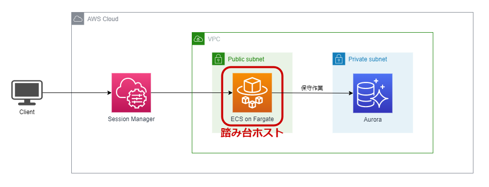

# Terraformを用いたECS on Fargateの踏み台ホスト構築
for ECS Bastion host  
[参考書籍：AWSコンテナ設計・構築[本格]入門](https://www.amazon.co.jp/AWS%E3%82%B3%E3%83%B3%E3%83%86%E3%83%8A%E8%A8%AD%E8%A8%88%E3%83%BB%E6%A7%8B%E7%AF%89-%E6%9C%AC%E6%A0%BC-%E5%85%A5%E9%96%80-%E6%A0%AA%E5%BC%8F%E4%BC%9A%E7%A4%BE%E9%87%8E%E6%9D%91%E7%B7%8F%E5%90%88%E7%A0%94%E7%A9%B6%E6%89%80/dp/4815607656?__mk_ja_JP=%E3%82%AB%E3%82%BF%E3%82%AB%E3%83%8A&crid=3M50R3784FE0U&keywords=AWS+%E3%82%B3%E3%83%B3%E3%83%86%E3%83%8A&qid=1644399270&sprefix=aws+%E3%82%B3%E3%83%B3%E3%83%86%E3%83%8A%2Caps%2C163&sr=8-1&linkCode=ll1&tag=dogharasu0f-22&linkId=a1e6db1e8f7aff9c33451c9942e4fb74&language=ja_JP&ref_=as_li_ss_tl)

# 構築方法
本リポジトリのコードを使用します。  
詳細な手順は以下記事で紹介しています。  
https://blog-benri-life.com/ecs-on-fargate-bastion-by-terraform/
